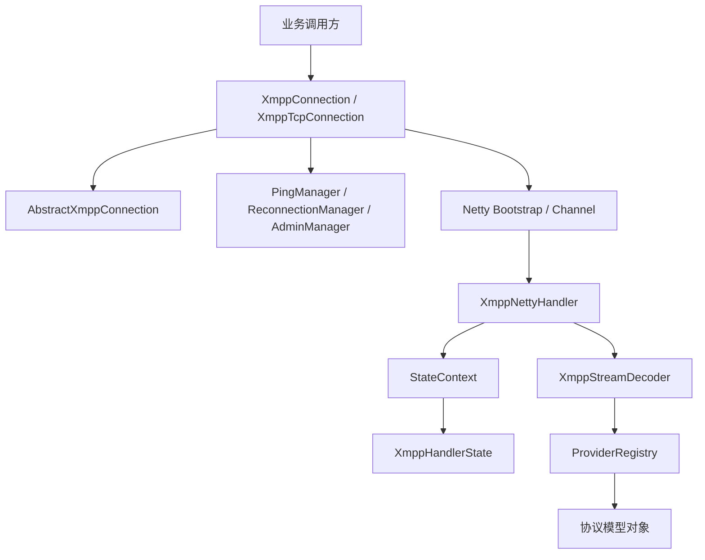
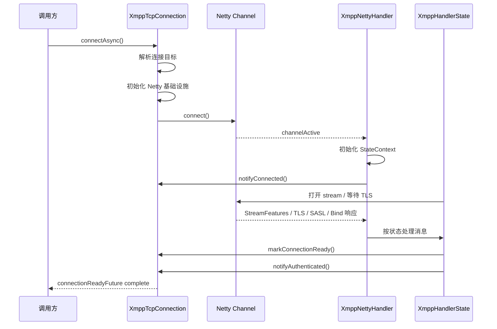
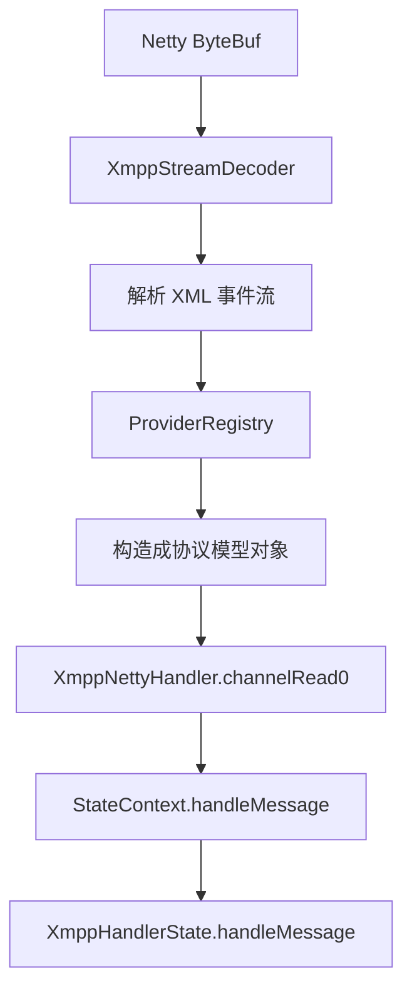
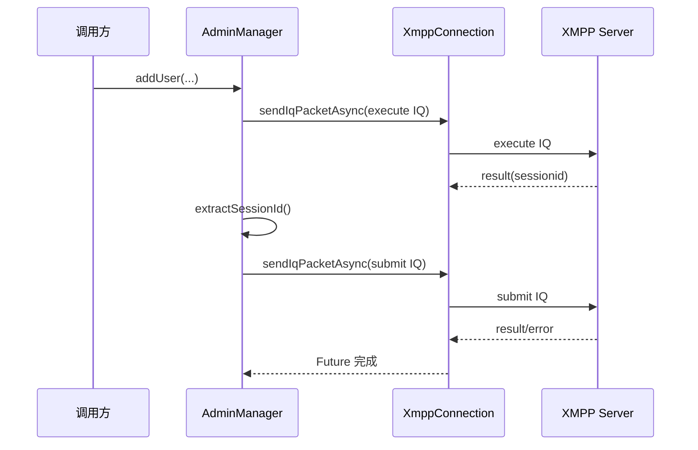

# XMPP 客户端软件实现设计文档

## 1. 文档目的

本文档基于当前代码仓库实现，描述 XMPP 客户端的整体框架设计、核心类职责、关键流程、线程模型、异常处理策略以及扩展方式。

本文档目标：

- 帮助开发人员快速理解当前实现
- 作为后续维护、重构和扩展的设计基线
- 为集成方提供连接、认证、收发、管理命令等能力的实现说明

本文档覆盖范围：

- `src/main/java` 下全部主代码
- 当前主实现所采用的 Netty、状态机、Provider 注册、事件总线和管理器协作方式

不覆盖范围：

- 测试代码逐条说明
- 外部服务端部署方案
- 业务系统接入示例

---

## 2. 系统定位

本项目是一个基于 Java 21 + Netty 的 XMPP TCP 客户端实现，面向以下目标：

- 建立到 XMPP 服务器的 TCP / TLS 连接
- 完成 STARTTLS 或 Direct TLS 协商
- 完成 SASL 认证
- 完成资源绑定与会话激活
- 支持 IQ、Message、Presence 等基本 stanza 的发送与接收
- 支持 XEP-0199 Ping
- 支持 XEP-0133 管理命令
- 支持自动重连、心跳保活、异步 collector 等客户端侧能力

实现特点：

- 以 `XmppTcpConnection` 为核心入口
- 以 `XmppHandlerState + StateContext` 实现会话状态机
- 以 `XmppNettyHandler` 对接 Netty 事件和 XMPP 协议处理
- 以 `ProviderRegistry` 完成 XML 元素到 Java 对象的解析扩展
- 以 `XmppEventBus` 实现连接生命周期事件广播

---

## 3. 技术栈与框架选型

### 3.1 语言与运行时

- Java 21
- Lombok
- Maven

### 3.2 网络框架

- Netty 4.1.x

采用 Netty 的原因：

- 支持异步非阻塞网络 I/O
- 管道机制适合 TLS、解码器、协议处理器串联
- `ChannelFuture` 便于将底层写操作结果反馈到业务层状态机

### 3.3 XML 处理

- Woodstox / StAX 用于解析
- `XmlStringBuilder` 用于协议对象序列化

设计原因：

- XMPP 报文是流式 XML，不适合简单对象序列化框架直接处理
- 当前实现需要精确控制 stanza 输出结构与顺序

### 3.4 日志

- SLF4J
- Log4j2

日志分级策略：

- `INFO`：重要生命周期节点
- `WARN`：可预期失败、配置问题、协议错误
- `ERROR`：非预期运行时错误
- `DEBUG`：协议细节、失败上下文、延迟回调跟踪

---

## 4. 目录与模块划分

主代码包结构如下：

```text
com.example.xmpp
├── AbstractXmppConnection.java
├── XmppConnection.java
├── XmppTcpConnection.java
├── Main.java
├── config/
├── event/
├── exception/
├── handler/
├── logic/
├── mechanism/
├── net/
├── protocol/
└── util/
```

各模块职责如下。

### 4.1 顶层连接模块

- `XmppConnection`
  - 定义连接接口
  - 约束 connect、disconnect、sendStanza、sendIqPacketAsync 等核心能力

- `AbstractXmppConnection`
  - 提供 collector 管理
  - 提供 IQ 请求处理器注册与分发
  - 提供连接生命周期事件发布
  - 提供统一的 IQ 请求-响应等待框架

- `XmppTcpConnection`
  - 基于 Netty 的 TCP 连接实现
  - 负责连接目标解析、Bootstrap 创建、连接建立、连接回收
  - 管理 `XmppNettyHandler`、`PingManager`、`ReconnectionManager`

### 4.2 配置模块

- `XmppClientConfig`
  - 不可变连接配置对象
  - 集中描述连接、认证、TLS、超时、重连、Ping 等参数

### 4.3 事件模块

- `ConnectionEvent`
- `ConnectionEventType`
- `XmppEventBus`

作用：

- 对连接生命周期进行订阅发布
- 解耦连接实现和附属管理器

### 4.4 协议解析与模型模块

- `protocol/model`
  - XMPP stanza、stream、sasl、extension 等数据模型

- `protocol/provider`
  - 将 XML 元素解析为扩展模型对象

- `ProviderRegistry`
  - 统一管理 Provider

- `AsyncStanzaCollector`
  - 提供异步响应等待机制

### 4.5 网络模块

- `XmppNettyHandler`
  - Netty 与状态机之间的桥接层

- `XmppStreamDecoder`
  - 流式 XML 解码器

- `SslUtils`
  - TLS 相关初始化工具

- `DnsResolver`
  - SRV 记录解析

### 4.6 状态机模块

- `StateContext`
  - 状态机上下文
  - 保存当前状态、连接配置、SASL 协商器、终止标记

- `XmppHandlerState`
  - 枚举形式的状态机
  - 定义状态进入、消息处理、状态切换规则

### 4.7 逻辑管理器模块

- `PingManager`
  - 负责认证后的保活 ping

- `ReconnectionManager`
  - 负责异常断开后的自动重连

- `AdminManager`
  - 负责 XEP-0133 管理命令封装

### 4.8 工具模块

- `ConnectionUtils`
- `NettyUtils`
- `SecurityUtils`
- `XmlStringBuilder`
- `XmlParserUtils`
- `XmppScheduler`
- `XmppConstants`
- `StanzaIdGenerator`

---

## 5. 系统总体架构

### 5.1 分层视图



### 5.2 核心协作关系

1. 调用方通过 `XmppTcpConnection` 发起连接
2. `XmppTcpConnection` 建立 Netty 通道并安装管道
3. `XmppNettyHandler` 在通道激活后初始化 `StateContext`
4. `XmppHandlerState` 按连接阶段推进协议状态
5. `XmppStreamDecoder` 将 XML 流解码为 Java 协议对象
6. 解码后的对象交回 `XmppNettyHandler` 与 `AbstractXmppConnection`
7. IQ 响应通过 `AsyncStanzaCollector` 回到调用方
8. `XmppEventBus` 驱动 `PingManager` 和 `ReconnectionManager`

---

## 6. 核心类设计

### 6.1 `XmppConnection`

定位：

- 统一的 XMPP 连接抽象接口

核心能力：

- `connect()`
- `disconnect()`
- `isConnected()`
- `isAuthenticated()`
- `sendStanza(...)`
- `sendIqPacketAsync(...)`
- `createStanzaCollector(...)`
- `registerIqRequestHandler(...)`

设计要点：

- 通过接口隔离具体传输实现
- 上层逻辑如 `AdminManager`、`PingManager` 依赖接口而非具体类

### 6.2 `AbstractXmppConnection`

定位：

- 所有连接实现的抽象公共层

承担职责：

- IQ 请求处理器注册与路由
- unsupported IQ 的标准错误响应
- collector 创建、移除、清理、异常结束
- IQ 请求发送与响应等待统一实现
- 连接事件发布

关键数据结构：

- `Queue<AsyncStanzaCollector> collectors`
- `Map<IqHandlerKey, IqRequestHandler> iqRequestHandlers`
- `AtomicBoolean terminalConnectionEventPublished`

设计意义：

- 让连接实现类聚焦底层传输
- 让 IQ 业务语义统一，不散落到各业务类

### 6.3 `XmppTcpConnection`

定位：

- 当前唯一的主连接实现

核心职责：

- 连接目标解析
- Netty 资源初始化与释放
- `XmppNettyHandler` 管理
- 会话就绪 Future 管理
- 当前活动通道归属判定
- pending collector 终止
- 手动断开 / 异常断开分流

核心字段：

- `XmppClientConfig config`
- `EventLoopGroup workerGroup`
- `Channel channel`
- `XmppNettyHandler nettyHandler`
- `PingManager pingManager`
- `ReconnectionManager reconnectionManager`
- `CompletableFuture<Void> connectionReadyFuture`
- `boolean disconnectRequested`

设计特点：

- 支持连接对象复用
- 支持建连进行中 Future 复用
- 通过 `bindActiveChannel()` 和 `isCurrentChannel()` 保证旧通道不会污染新生命周期

### 6.4 `XmppNettyHandler`

定位：

- Netty 事件到 XMPP 状态机的桥接器

处理内容：

- `channelActive`
- `channelInactive`
- `exceptionCaught`
- `channelRead0`
- `userEventTriggered` 中的 TLS 握手完成事件

设计要点：

- 使用 `StateContext` 保存当前会话状态
- 对 stale channel 做过滤
- 对已终止状态上下文做保护
- 将流级别错误、TLS 握手结果、普通入站 stanza 分开处理

### 6.5 `StateContext`

定位：

- 当前连接状态机上下文

承载信息：

- 当前配置
- 当前连接
- 当前状态
- `SaslNegotiator`
- `terminated` 标记

关键作用：

- 提供状态切换入口
- 提供状态机内部发包入口
- 提供错误关闭入口
- 避免旧连接异步回调继续推进状态机

### 6.6 `XmppHandlerState`

定位：

- 协议阶段状态机

当前主要状态：

- `INITIAL`
- `CONNECTING`
- `AWAITING_FEATURES`
- `TLS_NEGOTIATING`
- `SASL_AUTH`
- `BINDING`
- `SESSION_ACTIVE`

职责：

- 定义每个状态可接收的消息类型
- 定义状态切换规则
- 在关键写操作成功后推进下一状态
- 在失败时关闭连接

设计特点：

- 使用枚举承载状态行为
- 将会话协商过程显式建模
- 将“写成功后推进状态”作为统一规则

### 6.7 `ProviderRegistry`

定位：

- XML 扩展元素解析入口

职责：

- 注册内置 Provider
- 通过 SPI 自动发现扩展 Provider
- 为 `XmppStreamDecoder` 提供元素解析支持

扩展方式：

- 自定义实现 `ProtocolProvider`
- 通过 `ServiceLoader` 注入

### 6.8 `AsyncStanzaCollector`

定位：

- 异步响应等待器

职责：

- 基于 `StanzaFilter` 判断某条 stanza 是否匹配
- 用于 IQ request-response 模式

使用场景：

- 普通 IQ 异步等待
- 管理命令响应等待

### 6.9 `PingManager`

定位：

- 认证后定时发送 ping，维持会话活性

设计特点：

- 依赖 `XmppEventBus`
- 收到 `AUTHENTICATED` 启动 keepalive
- 收到 `CLOSED/ERROR` 停止 keepalive
- `shutdown()` 时取消订阅并禁止再次启动

### 6.10 `ReconnectionManager`

定位：

- 自动重连策略执行器

关键策略：

- 指数退避
- 随机抖动
- 可恢复错误与不可恢复错误区分
- `CONNECTED` 不重置周期
- `AUTHENTICATED` 才重置周期

不可恢复错误包括：

- `XmppAuthException`
- `XmppProtocolException`
- `XmppStanzaErrorException`

### 6.11 `AdminManager`

定位：

- XEP-0133 服务管理命令封装

能力包括：

- 添加用户
- 删除用户
- 修改密码
- 获取用户
- 查询在线用户
- 按域列出用户

设计特点：

- 统一走 `sendIqPacketAsync(...)`
- 单阶段命令和两阶段命令分别模板化
- 两阶段命令统一处理 execute / sessionId / submit 逻辑

---

## 7. 核心协议模型设计

协议模型位于 `protocol/model` 包下。

### 7.1 基本层次

- `XmppStanza`
  - XMPP stanza 统一接口

- `Stanza`
  - 抽象基类

- 具体类型
  - `Iq`
  - `Message`
  - `Presence`

### 7.2 扩展元素

- `ExtensionElement`
- `GenericExtensionElement`
- `Bind`
- `Ping`
- `AddUser`
- `DeleteUser`
- `GetUser`
- `ListUsers`
- `ChangeUserPassword`
- `GetOnlineUsers`

### 7.3 stream 与 SASL 模型

- stream
  - `StreamHeader`
  - `StreamFeatures`
  - `StreamError`
  - `TlsElements`

- sasl
  - `Auth`
  - `SaslChallenge`
  - `SaslSuccess`
  - `SaslFailure`
  - `SaslResponse`

模型设计原则：

- 每个协议对象都可序列化为 XML
- 扩展对象尽量只承载协议字段，不耦合连接行为

---

## 8. 连接建立流程

### 8.1 流程概览



### 8.2 连接目标解析

`XmppTcpConnection.resolveConnectionTargets()` 逻辑如下：

1. 计算端口
   - Direct TLS 默认 5223
   - 普通模式默认 5222
   - 如果显式配置端口，优先使用显式端口

2. 优先解析显式目标
   - `hostAddress`
   - `host`

3. 如果没有显式目标
   - 通过 `DnsResolver` 查询 SRV 记录
   - 若 SRV 查询失败或为空，则回退到服务域名直连

### 8.3 Netty 管道初始化

创建 `Bootstrap` 时安装的处理器包括：

- 可选 `SslHandler`
  - 仅在 Direct TLS 时先安装

- `XmppStreamDecoder`
  - 负责 XML 流解码

- `XmppNettyHandler`
  - 负责状态机和事件桥接

---

## 9. 会话协商流程

### 9.1 非 Direct TLS 模式

1. `CONNECTING`
   - 发送初始 stream

2. `AWAITING_FEATURES`
   - 收到 `StreamFeatures`
   - 根据配置与服务端能力判断：
     - 是否走 STARTTLS
     - 是否可直接 SASL
     - 是否直接进入 bind

3. `TLS_NEGOTIATING`
   - 发送 `StartTls`
   - 收到 `TlsProceed`
   - 安装 `SslHandler`
   - 等握手成功后重新打开 stream

4. `SASL_AUTH`
   - 发送 `Auth`
   - 处理 `Challenge / Success / Failure`
   - 认证成功后重新打开 stream

5. `BINDING`
   - 发送 bind IQ
   - 成功则根据配置决定是否发送 initial presence

6. `SESSION_ACTIVE`
   - 标记 ready
   - 发布 authenticated 事件

### 9.2 Direct TLS 模式

与普通模式差异：

- TCP 通道建立后先等待 TLS 握手
- 握手成功后才发送初始 stream
- 后续流程进入 `AWAITING_FEATURES`

### 9.3 状态推进原则

当前实现的重要设计点：

- 协议关键写操作必须在**写成功后**再推进状态
- 如果写失败，则立即关闭连接，而不是仅依赖超时

适用动作包括：

- 初始 stream 打开
- STARTTLS 请求
- SASL `auth`
- 认证成功后的 stream 重开
- bind 请求
- initial presence

---

## 10. 入站消息处理流程

### 10.1 解码流程



### 10.2 消息分发规则

`XmppNettyHandler.channelRead0()` 当前处理顺序：

1. 判断是否 stale channel
2. 判断 `stateContext` 是否已清理
3. `StreamHeader`
   - 仅记录日志
4. `StreamError`
   - 立即失败连接
5. 其他消息
   - 交给 `StateContext.handleMessage(...)`

### 10.3 收到普通 stanza 后的业务分发

当会话已建立后，普通 stanza 的处理包括：

- 先交给 `AbstractXmppConnection.notifyStanzaReceived(...)`
  - 尝试投递给 collector

- 如果是 IQ 请求
  - 尝试交给已注册 `IqRequestHandler`

- 如果客户端不支持该 IQ
  - 自动回复标准 `IQ error`

不支持 IQ 的错误条件规则：

- 已知命名空间但未实现：`feature-not-implemented`
- 未知命名空间：`service-unavailable`

---

## 11. 出站消息处理流程

### 11.1 普通 stanza

调用路径：

1. 调用方执行 `sendStanza(XmppStanza)`
2. `XmppTcpConnection.dispatchStanza(...)`
3. `XmppNettyHandler.sendStanza(...)`
4. `NettyUtils.writeAndFlushStringAsync(...)`

特点：

- 普通 stanza 发送对调用方仍是 fire-and-forget
- 但底层已经具备 `ChannelFuture` 感知能力
- 连接不可用时会拒绝发送并记录日志

### 11.2 IQ 请求

调用路径：

1. 调用 `sendIqPacketAsync(iq, timeout, unit)`
2. 参数校验
3. 创建 `AsyncStanzaCollector`
4. 通过 `dispatchStanza(...)` 发包
5. 监听发送结果
6. 等待 `RESULT / ERROR`
7. 收到 `IQ ERROR` 时映射为 `XmppStanzaErrorException`

当前行为特征：

- 写失败时立即结束 Future
- 连接关闭时 pending collector 立即失败
- 不再依赖纯超时兜底

---

## 12. 管理命令流程

`AdminManager` 封装的是 XEP-0133 服务管理命令。

### 12.1 单阶段命令

例如：

- `listUsers(domains)`

流程：

1. 构造管理命令 IQ
2. 调用 `sendAdminCommand(...)`
3. 直接返回响应

### 12.2 两阶段命令

例如：

- `addUser`
- `deleteUser`
- `changePassword`
- `getUser`

流程：



异常处理规则：

- execute 阶段返回 `IQ ERROR`，直接失败
- execute 阶段缺少 `sessionid`，直接失败
- execute 阶段已 `completed`，则不继续 submit
- submit 阶段返回 `IQ ERROR`，直接失败

---

## 13. 自动重连设计

### 13.1 事件驱动

`ReconnectionManager` 通过订阅以下事件工作：

- `CONNECTED`
- `AUTHENTICATED`
- `CLOSED`
- `ERROR`

### 13.2 行为规则

- `CONNECTED`
  - 仅停止当前待执行任务
  - 不重置重连周期

- `AUTHENTICATED`
  - 视为会话真正恢复
  - 重置重连周期

- `CLOSED`
  - 认为是正常关闭
  - 不触发重连

- `ERROR`
  - 如果错误可恢复，则开始重连
  - 如果错误不可恢复，则停止重连

### 13.3 退避策略

- 基础延迟：`BASE_DELAY_SECONDS`
- 最大延迟：`MAX_DELAY_SECONDS`
- 每轮叠加随机抖动

目标：

- 避免高频抖动
- 避免多个客户端同一时间同时重连

---

## 14. Ping 保活设计

### 14.1 启动条件

仅当满足以下条件时保活才会启动：

- 配置中启用 `pingEnabled`
- 会话已进入 `AUTHENTICATED`
- `PingManager` 未 `shutdown`

### 14.2 停止条件

- 收到 `CLOSED`
- 收到 `ERROR`
- 显式 `shutdown()`

### 14.3 设计取舍

当前实现选择：

- 断连时停止 ping
- 生命周期真正销毁时才取消订阅

这样做的原因：

- 同一连接对象如果后续自动重连成功，PingManager 仍可继续使用

---

## 15. Provider 与解码扩展设计

### 15.1 Provider 注册机制

`ProviderRegistry` 同时支持：

- 内置 Provider 注册
- SPI Provider 发现

当前内置 Provider：

- `BindProvider`
- `PingProvider`

### 15.2 自定义扩展方式

扩展方可以：

1. 实现 `Provider<?>`
2. 实现 `ProtocolProvider`
3. 在 `META-INF/services` 中注册
4. 启动时由 `ProviderRegistry` 自动发现

适用场景：

- 自定义 IQ 扩展
- 自定义消息扩展
- 特定服务端扩展协议

---

## 16. 异常模型设计

异常集中在 `exception` 包下，包括：

- `XmppException`
- `XmppNetworkException`
- `XmppAuthException`
- `XmppProtocolException`
- `XmppParseException`
- `XmppDnsException`
- `XmppSaslFailureException`
- `XmppStanzaErrorException`
- `XmppStreamErrorException`
- `AdminCommandException`

异常分类原则：

- 网络层问题：`XmppNetworkException`
- 认证问题：`XmppAuthException`
- 协议状态或解析问题：`XmppProtocolException` / `XmppParseException`
- 服务端 stanza error：`XmppStanzaErrorException`
- 服务端 stream error：`XmppStreamErrorException`

设计价值：

- 便于重连策略做可恢复性判断
- 便于业务调用方区分失败原因

---

## 17. 并发与线程模型

### 17.1 Netty 线程

Netty 负责：

- TCP 连接建立
- I/O 事件通知
- 管道处理
- TLS 握手回调

### 17.2 调用方线程

调用方可从任意线程调用：

- `connect()`
- `connectAsync()`
- `disconnect()`
- `sendIqPacketAsync()`
- `sendStanza()`

### 17.3 关键同步控制点

`XmppTcpConnection` 中对以下动作做了同步保护：

- `connectAsync()`
- `disconnect()`
- `markConnectionReady()`
- `failConnection(...)`
- `handleChannelInactive(...)`
- `bindActiveChannel(...)`

目标：

- 防止 `connect/disconnect` 并发时产生残留资源
- 防止旧通道事件结束新生命周期

### 17.4 延迟回调保护

以下异步回调都考虑了旧生命周期问题：

- TLS 握手完成回调
- SASL 写成功回调
- reopen stream 写成功回调
- initial presence 写成功回调

保护方式：

- 检查 `StateContext.isTerminated()`
- 检查 `ctx.channel().isActive()`
- 检查 `XmppTcpConnection.isCurrentChannel(...)`

---

## 18. 安全设计说明

### 18.1 TLS

支持：

- STARTTLS
- Direct TLS

支持的 TLS 相关配置：

- 自定义 `SSLContext`
- 自定义 `TrustManager`
- 自定义 `KeyManager`
- 单向认证 / 双向认证
- 自定义协议与 cipher

当前实现约束：

- **不启用 TLS 主机名校验**
- 仍进行证书链信任校验

### 18.2 SASL

支持机制：

- `PLAIN`
- `SCRAM-SHA-1`
- `SCRAM-SHA-256`
- `SCRAM-SHA-512`

安全规则：

- `PLAIN` 必须在已成功 TLS 握手的连接上使用
- TLS 握手未成功时不会把连接视为加密链路

### 18.3 敏感信息处理

- 日志输出通过 `SecurityUtils.filterSensitiveXml(...)` 过滤敏感字段
- 密码使用 `char[]`
- 关闭连接错误输出时避免直接透传敏感异常文本

---

## 19. 可扩展点设计

当前代码支持的主要扩展点如下。

### 19.1 协议扩展

- 新增 `ExtensionElement`
- 新增 `Provider`
- 注册 `IqRequestHandler`

### 19.2 自定义认证机制

- 实现 `SaslMechanism`
- 通过 `SaslMechanismFactory` 纳入选择

### 19.3 自定义连接策略

当前主实现是 `XmppTcpConnection`，如需扩展其他连接方式，可复用：

- `XmppConnection`
- `AbstractXmppConnection`

### 19.4 管理命令扩展

可在 `protocol/model/extension` 中添加新的命令元素，并在 `AdminManager` 中增加相应封装。

---

## 20. 当前实现的设计边界

以下是当前实现刻意保留的边界。

### 20.1 普通 stanza 发送仍然不向调用方返回结果

原因：

- 当前业务主需求集中在 IQ 请求-响应
- 普通 stanza 的“可靠送达确认”没有统一协议语义

### 20.2 TLS 主机名校验未启用

这是当前代码的显式行为，不是遗漏。若业务需要更严格 TLS 校验，需要在 `SslUtils` 和配置层继续扩展。

### 20.3 状态机集中在单个枚举中

优点：

- 全流程集中可见

代价：

- 文件相对较大

当前仍认为可维护，暂未拆为多类状态对象。

---

## 21. 典型调用方式

### 21.1 建立连接

```java
XmppClientConfig config = XmppClientConfig.builder()
        .xmppServiceDomain("example.com")
        .username("user")
        .password("secret".toCharArray())
        .build();

XmppTcpConnection connection = new XmppTcpConnection(config);
connection.connect();
```

### 21.2 发送 IQ 并等待响应

```java
Iq iq = new Iq.Builder(Iq.Type.GET)
        .id("ping-1")
        .to("example.com")
        .childElement(new Ping())
        .build();

connection.sendIqPacketAsync(iq);
```

### 21.3 使用管理命令

```java
AdminManager adminManager = new AdminManager(connection, config);
adminManager.addUser("newuser", "password", "user@example.com");
```

---

## 22. 总结

当前实现形成了较完整的 XMPP 客户端核心框架，具备以下特征：

- 以 `XmppTcpConnection` 为中心的连接生命周期管理
- 以 `XmppNettyHandler + StateContext + XmppHandlerState` 为中心的协议状态机
- 以 `AbstractXmppConnection + AsyncStanzaCollector` 为中心的异步请求响应模型
- 以 `XmppEventBus` 驱动的附属能力解耦
- 以 `ProviderRegistry` 支撑的协议元素扩展机制

在当前版本中，设计重点已经从“能连通”扩展到“生命周期稳定、失败传播明确、旧状态不污染新生命周期”。因此本实现更适合作为：

- 独立的 XMPP 客户端基础库
- 上层业务系统的 XMPP 接入底座
- 后续扩展消息、Presence、更多 XEP 的基础实现

后续如需继续增强，建议优先方向：

- 更丰富的 stanza 业务处理模型
- 更严格的 TLS 校验策略
- 更完整的消息/Presence 业务封装
- 更细粒度的监控与指标采集

