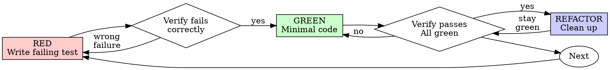

# TDD Principles (详细)

## Overview

Write the test first. Watch it fail. Write minimal code to pass.

**Core principle:** If you didn't watch the test fail, you don't know if it tests the right thing.

---

## The Iron Law

```
NO PRODUCTION CODE WITHOUT A FAILING TEST FIRST
```

Write code before the test? Delete it. Start over.

**No exceptions:**
- Don't keep it as "reference"
- Don't "adapt" it while writing tests
- Don't look at it
- Delete means delete

Implement fresh from tests. Period.

---

## When to Use TDD

**Always:**
- New features
- Bug fixes
- Refactoring
- Behavior changes

**Exceptions (ask your human partner):**
- Throwaway prototypes
- Generated code
- Configuration files

Thinking "skip TDD just this once"? Stop. That's rationalization.

---

## The Red-Green-Refactor Cycle



---

## RED - Write Failing Test

Write one minimal test showing what should happen.

```java
// Good test example
@Test
public void testRetriesFailedOperations3Times() {
    // Given: A counter to track attempts
    AtomicInteger attempts = new AtomicInteger(0);
    
    // When: Call operation that fails twice then succeeds
    String result = retryOperation(() -> {
        attempts.incrementAndGet();
        if (attempts.get() < 3) throw new RuntimeException("fail");
        return "success";
    });
    
    // Then: Verify result and attempt count
    assertEquals("success", result);
    assertEquals(3, attempts.get());
}
```

**Requirements:**
- One behavior
- Clear name
- Real code (no mocks unless unavoidable)

---

## Verify RED - Watch It Fail

**MANDATORY. Never skip.**

```bash
mvn test -Dtest=ClassNameTest
```

Confirm:
- Test fails (not errors)
- Failure message is expected
- Fails because feature missing (not typos)

**Test passes?** You're testing existing behavior. Fix test.

**Test errors?** Fix error, re-run until it fails correctly.

---

## GREEN - Minimal Code

Write simplest code to pass the test.

```java
// Just enough to pass - NO YAGNI
public String retryOperation(Supplier<String> operation) {
    for (int i = 0; i < 3; i++) {
        try {
            return operation.get();
        } catch (Exception e) {
            if (i == 2) throw e;
        }
    }
    throw new RuntimeException("unreachable");
}
```

Don't add features, refactor other code, or "improve" beyond the test.

---

## Verify GREEN - Watch It Pass

**MANDATORY.**

```bash
mvn test -Dtest=ClassNameTest
```

Confirm:
- Test passes
- Other tests still pass
- Output pristine (no errors, warnings)

**Test fails?** Fix code, not test.

**Other tests fail?** Fix now.

---

## REFACTOR - Clean Up

After green only:
- Remove duplication
- Improve names
- Extract helpers

Keep tests green. Don't add behavior.

---

## Why Order Matters

| Approach | What It Answers | Problem |
|---------|----------------|---------|
| Test-First | "What should this do?" | Proves it catches bugs |
| Test-After | "What does this do?" | Biased by implementation |

**"I'll write tests after to verify it works"**

Tests written after code pass immediately. Passing immediately proves nothing:
- Might test wrong thing
- Might test implementation, not behavior
- Might miss edge cases you forgot
- You never saw it catch the bug

Test-first forces you to see the test fail, proving it actually tests something.

---

## Good Tests

| Quality | Good | Bad |
|---------|------|-----|
| **Minimal** | One thing. "and" in name? Split it. | `test('validates email and domain and whitespace')` |
| **Clear** | Name describes behavior | `test('test1')` |
| **Shows intent** | Demonstrates desired API | Obscures what code should do |

---

## Common Rationalizations

| Excuse | Reality |
|--------|---------|
| "Too simple to test" | Simple code breaks. Test takes 30 seconds. |
| "I'll test after" | Tests passing immediately prove nothing. |
| "Tests after achieve same goals" | Tests-after = "what does this do?" Tests-first = "what should this do?" |
| "Already manually tested" | Ad-hoc ≠ systematic. No record, can't re-run. |
| "Deleting X hours is wasteful" | Sunk cost fallacy. Keeping unverified code is technical debt. |

---

## Red Flags - STOP and Start Over

- Code before test
- Test after implementation
- Test passes immediately
- Can't explain why test failed
- Tests added "later"
- Rationalizing "just this once"

**All of these mean: Delete code. Start over with TDD.**

---

## TDD for Bug Fixes

**Bug:** Empty email accepted

**RED**
```java
@Test
public void testRejectsEmptyEmail() {
    Result result = submitForm("");
    assertEquals("Email required", result.getError());
}
```

**Verify RED**
```bash
$ mvn test
FAIL: expected 'Email required', got null
```

**GREEN**
```java
Result submitForm(String email) {
    if (email == null || email.isBlank()) {
        return new Result("Email required");
    }
    // ...
}
```

**Verify GREEN**
```bash
$ mvn test
PASS
```

**REFACTOR**
Extract validation if needed.
